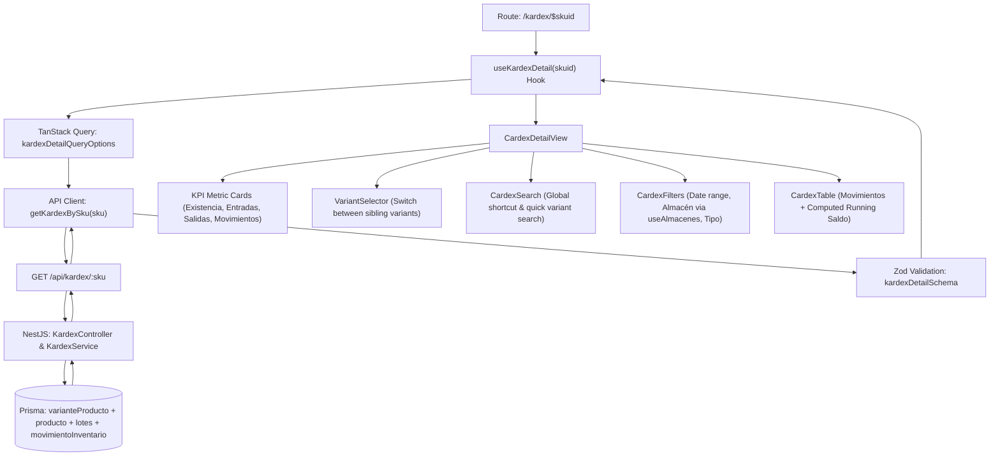

# 📊 Kardex Variant Detailed Panel Plan (`$skuid`)

## 🎯 Objective
Implement an end-to-end Kardex Detail & Movement Audit Panel for product variants identified by SKU (`/kardex/$skuid`), including TanStack Query caching, parent product and sibling variant switching, dynamic multi-dimensional filtering (date range, warehouse via `useAlmacenes`, and movement type), chronological running balance (*saldo acumulado*) calculation, real-time KPI metrics, rich state management, and robust error/loading handling.

---

## 🏗️ Architecture & Data Flow Overview



---

## 🖥️ FRONTEND

### 1. Data Layer, Schemas & API Integration
- [ ] **Zod Validation Schemas** (`features/Kardex/schemas/schemas.ts`):
  - Standardize and expand schemas for the Kardex detail response and table rows:
    ```typescript
    // Sibling variant item
    export const varianteKardexSchema = z.object({
      id: z.number(),
      sku: z.string(),
      nombre: z.string(),
      precioBase: z.number().optional(),
    });

    // Individual movement row in table
    export const kardexMovimientoRowSchema = z.object({
      id: z.number(),
      fechaMovimiento: z.string(),
      tipoMovimiento: z.enum(["ENTRADA", "SALIDA"]),
      cantidad: z.number(),
      saldo: z.number(), // Running balance computed per movement
      costoUnitario: z.number(),
      precioUnitario: z.number().optional(),
      numeroLote: z.string(),
      loteId: z.number(),
      almacen: z.object({
        id: z.number(),
        nombre: z.string(),
        tipo: z.enum(["PRINCIPAL", "TRANSITO", "MERMA"]).optional(),
      }),
      documento: z.string(), // e.g. "ORD-2026-0042" or reference
      operacion: z.string(), // e.g. "Despacho en ruta", "Reingreso por rechazo", "Ajuste de inventario"
      ordenId: z.number().nullable().optional(),
      usuario: z.string().optional(),
      referencia: z.string().optional(),
    });

    // Complete detail payload for a variant
    export const kardexDetailSchema = z.object({
      producto: z.object({
        id: z.number(),
        nombre: z.string(),
        descripcion: z.string().nullable().optional(),
      }),
      varianteActual: z.object({
        id: z.number(),
        sku: z.string(),
        nombre: z.string(),
        precioBase: z.number(),
        existenciaTotal: z.number(),
      }),
      variantes: z.array(varianteKardexSchema), // All sibling variants of the product
      movimientos: z.array(kardexMovimientoRowSchema),
      resumen: z.object({
        existenciaActual: z.number(),
        totalEntradas: z.number(),
        totalSalidas: z.number(),
        totalMovimientos: z.number(),
      }),
    });

    export type KardexMovimientoRow = z.infer<typeof kardexMovimientoRowSchema>;
    export type KardexDetail = z.infer<typeof kardexDetailSchema>;
    ```

- [ ] **API Client** (`features/Kardex/api/api.ts`):
  - Add `getKardexBySku(sku: string, signal?: AbortSignal): Promise<KardexDetail>`
  - Request endpoint: `GET /kardex/${encodeURIComponent(sku)}`
  - Parse and validate response using `kardexDetailSchema.parse(response.data)`
  - Handle Axios errors, 404 (Variant Not Found), and abort cancellations gracefully.

- [ ] **TanStack Query Options** (`features/Kardex/hooks/queries/queryoptions.ts`):
  - Define `kardexDetailQueryOptions(sku: string)`:
    - `queryKey: ['kardex', 'detail', sku.trim()]`
    - `queryFn: ({ signal }) => getKardexBySku(sku.trim(), signal)`
    - `enabled: Boolean(sku && sku.trim().length > 0)`
    - `staleTime: 1000 * 60 * 2` (2 minutes)
    - `placeholderData: (previousData) => previousData` (smooth transitions between variant clicks)

- [ ] **Custom Hook** (`features/Kardex/hooks/queries/queries.ts`):
  - Expose `useKardexDetail(sku: string)` returning `data`, `isLoading`, `isError`, `error`, and `refetch`.

---

### 2. Route Implementation (`routes/kardex/$skuid/index.tsx`)
- [ ] **Route Parameter Handling**:
  - Extract route parameter `skuid` via `const { skuid } = Route.useParams()`.
  - Validate and trim `skuid`.
- [ ] **Store Integration**:
  - Automatically register variant in `useKardexSearchStore.addRecent(...)` once data loads successfully with real `nombre` and `productName`.
- [ ] **Client-side Filtering & Computed Metrics**:
  - Manage state for:
    - `desde: string` (ISO start date filter)
    - `hasta: string` (ISO end date filter)
    - `tipo: TipoFiltro` ("TODOS" | "ENTRADAS" | "SALIDAS")
    - `almacen: string` ("ALL" or specific warehouse ID string)
  - Compute filtered rows with `useMemo`:
    - Filter by warehouse: `almacen === 'ALL' || String(r.almacen.id) === almacen`
    - Filter by movement type: `tipo === 'TODOS' || (tipo === 'ENTRADAS' ? r.tipoMovimiento === 'ENTRADA' : r.tipoMovimiento === 'SALIDA')`
    - Filter by date range: `desde` and `hasta` comparing timestamps.
  - Dynamically recalculate KPI summary cards based on the filtered view:
    - **Existencia actual**: Variant's current physical stock across all lots (or selected warehouse).
    - **Entradas (filtro)**: Sum of quantities for ENTRADA matching current filters.
    - **Salidas (filtro)**: Sum of quantities for SALIDA matching current filters.
    - **Movimientos (filtro)**: Count of movements matching current filters.
- [ ] **SEO & Metadata**:
  - Set dynamic `<title>` and OpenGraph tags: `"Kardex {sku} - {productName} | Logística"`.

---

### 3. Component Architecture & UI Composition

- [ ] **Warehouse Filter Integration** (`features/Kardex/components/KardexFilters.tsx`):
  - Consume warehouses directly via `useAlmacenes()` from `@/hooks/queries/queries`.
  - Map warehouse options to `{ value: String(a.id), label: a.nombre, hint: a.tipo }`.
  - Include `"ALL"` option: `{ value: "ALL", label: "Todos los almacenes" }`.
  - Provide date pickers (`Desde`, `Hasta`), warehouse combobox, type toggles (`TODOS`, `ENTRADAS`, `SALIDAS`), and dynamic "Limpiar filtros" reset button when active.

- [ ] **Variant Selector Component** (`features/Kardex/components/KardexVariantSelector.tsx`):
  - Receive `variantes: VarianteKardex[]` and `activo: string` (`skuid`).
  - Fix router navigation link:
    ```tsx
    <Link
      to="/kardex/$skuid"
      params={{ skuid: v.sku }}
      replace
      className={...}
    >
      {v.nombre}
      <span className="ml-2 font-mono text-[10px] opacity-75">{v.sku}</span>
    </Link>
    ```
  - Display active pill with highlighted primary styles, inactive with subtle border/hover styles.

- [ ] **Kardex Search Bar Integration** (`features/Kardex/components/KardexSearch.tsx`):
  - Embed `CardexSearch` in header for instant switching to any other product/SKU.
  - Fix navigation target inside `handleSelect` to `to: '/kardex/$skuid', params: { skuid: item.sku }`.

- [ ] **Movement Table Component** (`features/Kardex/components/KardexTable.tsx`):
  - Render sticky table header and scrollable body.
  - Columns:
    1. **Fecha / Hora**: Formatted locale date & time (`toLocaleString("es-DO")`).
    2. **Documento / Ref**: Clickable link to `/despachos/$ordenId` if `ordenId` exists, else plain text/badge.
    3. **Operación**: Badge with directional icon (`ArrowDownRight` for ENTRADA in green/liquidated status tone, `ArrowUpRight` for SALIDA in transit/accent tone).
    4. **Lote**: Monospace lote number badge (`numeroLote`).
    5. **Almacén**: Warehouse name & badge.
    6. **Cantidad**: Monospace formatted quantity with `+` (ENTRADA) or `−` (SALIDA).
    7. **Costo / Precio Unit**: Monospace currency display.
    8. **Saldo Acumulado**: Monospace bold running balance resulting after the movement.
  - Empty state: `"Sin movimientos para los filtros seleccionados."` with reset filters action.

- [ ] **State Handling (Loading, Error & Empty)**:
  - **Loading State**: Skeleton cards for KPIs, skeleton pills for variants, skeleton table rows.
  - **Error / 404 State**: Clean alert banner (`"SKU no encontrado"` or `"Error al cargar el Kardex"`) with back to Kardex search button (`/kardex`) and retry action.
  - **Zero Movements State**: When a variant exists but has no movement history yet, display informational banner with stock on hand and empty table message.

---

## ⚙️ BACKEND

### 1. API Endpoint Specification
- [ ] **Route**: `GET /api/kardex/:sku`
- [ ] **Parameters**:
  - `sku` (path parameter): String, required, trimmed.
- [ ] **Query Parameters (Optional Server-side filtering)**:
  - `almacenId` (optional number)
  - `desde` (optional ISO date string)
  - `hasta` (optional ISO date string)
  - `tipo` (optional "ENTRADA" | "SALIDA")

### 2. Business Logic & Query Implementation (`kardex.service.ts`)
- [ ] **Variant & Product Resolution**:
  - Query `prisma.varianteProducto.findUnique` where `{ sku }`:
    - Include parent `producto` with all its `variantes` (to populate sibling variant selector).
    - Include `lotes` for this variant to compute physical `stockActual` and total inventory.
  - If variant does not exist, throw `NotFoundException("Variante con SKU '${sku}' no encontrada")`.
- [ ] **Movimientos Retrieval**:
  - Query `prisma.movimientoInventario.findMany` where:
    - `lote: { varianteId: variant.id }`
  - Include relations:
    - `lote`: `{ select: { id: true, numeroLote: true, stockActual: true, fechaVencimiento: true } }`
    - `almacen`: `{ select: { id: true, nombre: true, tipo: true } }`
    - `detalleOrden`: `{ include: { orden: { select: { id: true, numeroOrden: true, tipoOrden: true, estado: true } } } }`
    - `detalleRechazo`: `{ include: { motivoRechazo: true } }`
    - `usuario`: `{ select: { id: true, nombreUsuario: true } }`
  - Order chronologically: `orderBy: { fechaMovimiento: 'asc' }` (or `id: 'asc'`).

### 3. Chronological Running Balance & Response Serialization
- [ ] **Calculate Running Balance (Saldo Acumulado)**:
  - Iterate through movements chronologically (oldest to newest):
    ```typescript
    let runningBalance = 0;
    const movimientosWithSaldo = movimientosAsc.map((m) => {
      if (m.tipoMovimiento === 'ENTRADA') {
        runningBalance += m.cantidad;
      } else {
        runningBalance -= m.cantidad;
      }

      // Determine human-readable operation label
      let operacion = 'Movimiento de inventario';
      if (m.detalleRechazo) {
        operacion = `Reingreso (${m.detalleRechazo.motivoRechazo.descripcion})`;
      } else if (m.detalleOrden) {
        operacion = m.detalleOrden.orden.tipoOrden === 'VENTA_MOSTRADOR'
          ? 'Venta mostrador'
          : 'Despacho en ruta';
      } else if (m.referencia) {
        operacion = m.referencia;
      }

      const documento = m.detalleOrden?.orden?.numeroOrden || m.referencia || `MOV-${m.id}`;
      const costoUnitario = m.detalleOrden?.precioUnitario
        ? Number(m.detalleOrden.precioUnitario)
        : Number(variant.precioBase);

      return {
        id: m.id,
        fechaMovimiento: m.fechaMovimiento?.toISOString() || new Date().toISOString(),
        tipoMovimiento: m.tipoMovimiento,
        cantidad: m.cantidad,
        saldo: runningBalance,
        costoUnitario,
        precioUnitario: Number(variant.precioBase),
        numeroLote: m.lote.numeroLote,
        loteId: m.lote.id,
        almacen: {
          id: m.almacen.id,
          nombre: m.almacen.nombre,
          tipo: m.almacen.tipo,
        },
        documento,
        operacion,
        ordenId: m.detalleOrden?.orden?.id ?? null,
        usuario: m.usuario?.nombreUsuario,
        referencia: m.referencia,
      };
    });
    ```
  - Sort results reverse-chronologically (`desc`) for UI presentation while preserving the exact computed `saldo` for each step.
- [ ] **Summary Statistics Aggregation**:
  - Calculate:
    - `existenciaActual`: total sum of `lote.stockActual` for the variant.
    - `totalEntradas`: sum of `cantidad` for all ENTRADA movements.
    - `totalSalidas`: sum of `cantidad` for all SALIDA movements.
    - `totalMovimientos`: count of movements.
- [ ] **Construct Response Payload**:
  ```json
  {
    "producto": {
      "id": 1,
      "nombre": "Mayonesa Kraft",
      "descripcion": "Mayonesa tradicional frasco"
    },
    "varianteActual": {
      "id": 101,
      "sku": "MAYO-350-REG",
      "nombre": "Mayonesa 350g Regular",
      "precioBase": 2.50,
      "existenciaTotal": 140
    },
    "variantes": [
      { "id": 101, "sku": "MAYO-350-REG", "nombre": "Mayonesa 350g Regular" },
      { "id": 102, "sku": "MAYO-500-LGT", "nombre": "Mayonesa 500g Light" }
    ],
    "movimientos": [
      {
        "id": 45,
        "fechaMovimiento": "2026-08-20T14:30:00.000Z",
        "tipoMovimiento": "SALIDA",
        "cantidad": 15,
        "saldo": 140,
        "costoUnitario": 2.50,
        "numeroLote": "LOT-2026-08-01",
        "loteId": 12,
        "almacen": { "id": 1, "nombre": "Almacén Principal", "tipo": "PRINCIPAL" },
        "documento": "ORD-2026-0042",
        "operacion": "Despacho en ruta",
        "ordenId": 42,
        "usuario": "davidprz"
      }
    ],
    "resumen": {
      "existenciaActual": 140,
      "totalEntradas": 200,
      "totalSalidas": 60,
      "totalMovimientos": 5
    }
  }
  ```

---

## 🧪 VERIFICATION & TEST PLAN

### 1. Backend Verification
- [ ] **Unit Tests** (`kardex.service.spec.ts`):
  - Test `getKardexBySku` with valid SKU: validates correct parent product resolution, sibling variants extraction, running balance accuracy, and summary calculations.
  - Test `getKardexBySku` with invalid SKU: confirms `NotFoundException` (404).
  - Test variant with 0 movements: returns empty `movimientos` array and correct `existenciaActual`.
- [ ] **E2E / Controller Test** (`kardex.controller.spec.ts`):
  - Verify `GET /api/kardex/:sku` endpoint returns HTTP 200 with schema-compliant payload.

### 2. Frontend Verification
- [ ] **Schema & Hook Tests**:
  - Validate response matching `kardexDetailSchema`.
  - Validate TanStack query cache key `['kardex', 'detail', sku]`.
- [ ] **UI & Interaction Flow**:
  - Direct navigation to `/kardex/:sku` loads data and updates recent search history.
  - Clicking sibling variant pill switches route smoothly and loads new variant data without full page reload.
  - Header `CardexSearch` allows jumping to another product's SKU directly.
  - Warehouse dropdown reflects live warehouses from `useAlmacenes()`.
  - Date and movement type filters update table rows and recompute filtered KPIs dynamically.
  - Clicking order reference link navigates to `/despachos/$ordenId`.
  - Keyboard navigation (`Ctrl + K`) works as expected.
  - Skeleton and error states display properly.
